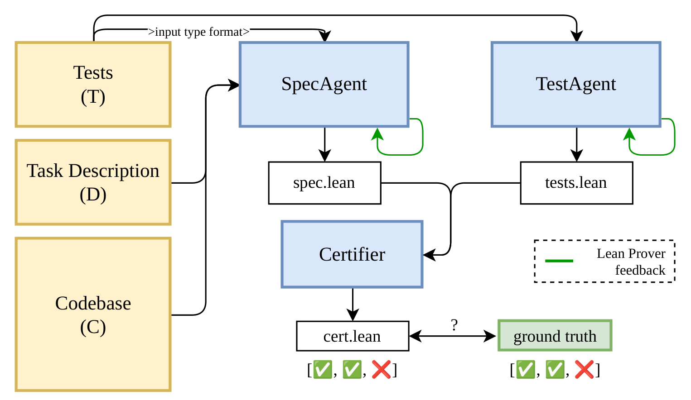


<h1 align="center">SpecGuard</h1>
<h3 align="center">Proving a Task Is Broken Before the Agent Cheats</h3>

<p align="center">
    <a href="https://arxiv.org/abs/2610.09159"></a>
    <a href="PLACEHOLDER_BLOG_URL"></a>
</p>

SpecGuard checks whether a coding task's description and its tests can both be satisfied, before any agent works on the task. When they cannot, it produces a machine-checked Lean 4 certificate of the conflict. The certificate can be re-verified in seconds by the Lean kernel, without trusting the models that generated it.

**Why this exists.** Agents given tasks whose tests contradict the description rarely report the conflict. They cheat: editing tests, hard-coding outputs, or deleting the code the task was asking for ([ImpossibleBench](https://arxiv.org/abs/2510.20270)). SpecGuard catches the broken objective before an agent, or a training run, learns to cheat on it.

<p align="center">
    
</p>

## Pipeline

Given a task (description, codebase, tests), three agents run in a Lean compiler feedback loop:

- A **SpecAgent** reads the description and codebase and writes `spec.lean`, an executable formalization of the stated intent. It never sees the tests, so a corrupted test cannot leak into the notion of intent it is compared against.
- A **TestAgent** independently translates the test assertions into `tests.lean`.
- A **Certifier** connects the two and attempts to prove that no implementation satisfies both. When the proof closes, the harness emits `cert.lean`, checked by the Lean kernel with `decide`.

The result is one of **conflict**, **no-conflict**, or **inconclusive**. A conflict verdict may be certified (kernel-checked proof) or supported by execution evidence only. Inconclusive is a deliberate outcome: it is the correct answer when the description does not determine the tested behavior, or when no faithful connection between the representations can be built.

A valid certificate proves the generated formalizations are jointly unsatisfiable. That the formalizations faithfully capture the original task is inferred, not proven; inspect the saved inputs and agent logs.

## Results

On 349 conflicted SWE-bench tasks (ImpossibleBench-style mutations, corrupted test suite only):

|  | Detected | Certified | FN |
|---|---|---|---|
| SpecGuard (GPT-5.6 Sol) | 57.0% | 51.1% | 8.1% |
| SpecGuard (best per metric, across 4 models) | 72.8% | 51.1% |  |
| LLM judge agent, same model, full codebase + test access | 60.2% | 0% | 39.8% |
    
The judge has a nearly five-fold higher conflict miss rate, and it almost never abstains, so its false negatives arrive as confident clearances. Average SpecGuard cost is $0.26 per task.

<p align="center">
    
</p>

Beyond the benchmark: pointed at 22 naturally occurring test conflicts from recent GitHub issues and pull requests, the CLI returned 9 conflict verdicts, 8 with Lean certificates. On VERINA's 187 tasks, generated specifications are proven bidirectionally equivalent to the human-written references 96.3% of the time. Full counts, settings, and failure analysis are in the paper.

## Quickstart

From an already-set-up repository, give the CLI a task description:

```bash
uv run specguard "The parser should accept dates in YYYY-MM-DD format."
```

It selects relevant tests, builds the Lean model of intended behavior, translates the tests separately, and checks whether both can hold. Results are written to `output/specguard/` in the checked repository; source and tests are never edited. Certificates are checked against the pinned runtime recorded with each result.

**Requirements.** Python 3.10+, Docker, Bubblewrap, and uv.

From this checkout, install dependencies and set your model, key, and OpenAI-compatible endpoint in your terminal (not in `.env`). No configuration file is required:

```bash
uv sync
export SPECGUARD_MODEL=your-model-id
export LLM_API_KEY=your_key
export LLM_BASE_URL=https://your-provider.example/v1
uv run specguard setup
uv run specguard "Describe the intended behavior here"
```

Use the model ID supported by your endpoint. Existing provider-specific variables and explicit YAML settings remain supported.

**Lean runtime.** Point `SPECGUARD_LEAN_ROOT` at an existing directory containing `workspace/`, `repl/`, and `elan/` (default `/mnt/data/lean`), or omit it and run `uv run specguard setup` once to download and build pinned Lean 4 v4.24.0, Mathlib, and REPL inside Docker. First setup downloads several GB and needs internet; later checks reuse the image with networking disabled. Setup verifies a Lean proof and saves its choice in `~/.config/specguard/runtime.json`, separately from model settings. To select an existing installation persistently, use `uv run specguard setup --lean-root /path/to/lean`. Explicit `SPECGUARD_LEAN_ROOT` or `SPECGUARD_LEAN_IMAGE` overrides the saved choice; the directory takes precedence when both are set. `specguard-bench` uses the same selection.

The CLI reads these environment variables from the trusted shell; it does not automatically load `.env`. The benchmark launcher does load this checkout's `.env`. Run `uv run --extra dev pytest -q -m 'not lean'` for the no-Lean test suite; the full suite can start Lean containers.

## Reproducing the paper

| Command | Purpose |
|---|---|
| `uv run specguard-bench --config configs/specguard.yaml --task TASK_ID --build` | Run one packaged task; building its image may take time. |
| `uv run swebench-lean --config configs/swebench_lean.yaml --limit 1 --workers 1` | One SWE-bench smoke task; makes paid model calls. |
| `uv run swebench-python --config configs/swebench_py.yaml --limit 1` | Python reference-model track. |
| `uv run python -m conflict_certifier.cli lcb --config configs/livecodebench.yaml --limit 1` | LiveCodeBench track. |

Run these from this source checkout; they use its `configs/` and `data/` directories. Installing the Python wheel alone does not install the benchmark datasets or Harbor task packages. The full SWE-bench commands need the frozen inputs under `data/swebench/` and the corresponding SWE-bench task images; `specguard-bench` needs the task images described in `data/specguard/`. Some packages require services or hardware and are not turnkey. The candidate-fix consensus baseline additionally needs `uv sync --extra consensus`.

For the SWE-bench and LiveCodeBench runners on a non-default Lean location, also export `LEAN_PROJECT=$SPECGUARD_LEAN_ROOT/workspace`, `REPL_BIN=$SPECGUARD_LEAN_ROOT/repl/.lake/build/bin/repl`, `ELAN_BIN=$SPECGUARD_LEAN_ROOT/elan/bin`, and `LEAN_CONTAINER_MOUNT_ROOT=$SPECGUARD_LEAN_ROOT`.

## Citation

```bibtex
@misc{biyani2026specguardprovingtaskbroken,
      title={SpecGuard: Proving a Task Is Broken Before the Agent Cheats}, 
      author={Param Biyani and Krishnamurthy Dvijotham},
      year={2026},
      eprint={2610.09159},
      archivePrefix={arXiv},
      primaryClass={cs.AI},
      url={https://arxiv.org/abs/2610.09159}, 
}
```
